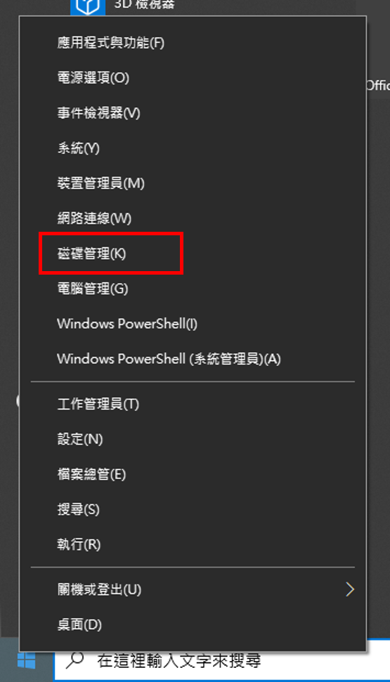

# Install-Ubuntu(Dual system)
This is the steps to install Ubuntu with IOS USB.

## windows
* 磁碟管理(分割硬碟):

   1. (C):200GB 
   1. (D):400GB

## Bios
* 由 IOS USB 開機

## 安裝畫面
1. 選擇語言
1. 準備安裝兩個都按
1. 安裝類型選其他(ntfs是windows , ext4是linux)
  * 掛載點 /:50GB
  * 用途(置換空間):100GB
  * /boot:1GB 
  * EFI system :1GB
  * 掛載點 /home:越大越好(但不要分完)
  * 安裝開機程式的裝置:
   * /dev/sda:這樣重新開機啟動電腦，就會有選單/菜單，給你選擇了
   * /dev/sdb: 將系統的開機程式 (MBR) 安裝至USB外接式硬碟中
